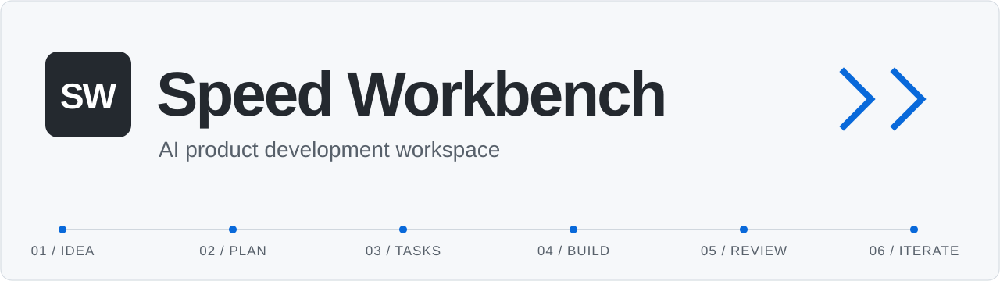
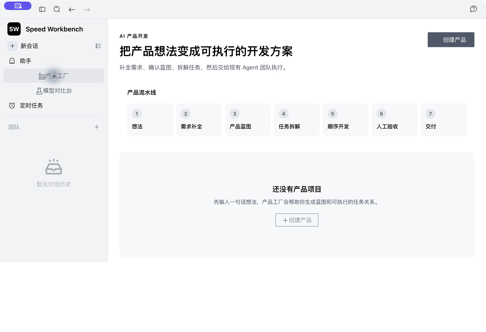
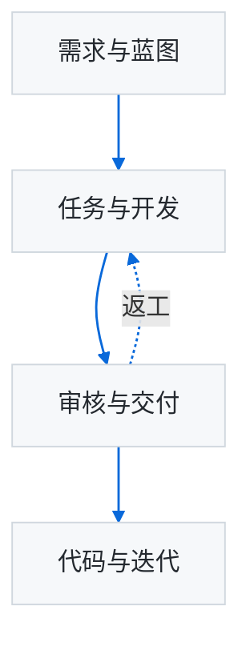

<p align="center">
  <picture>
    <source media="(prefers-color-scheme: dark)" srcset="docs/assets/readme/hero-dark.svg">
    
  </picture>
</p>

<h1 align="center">把想法变成应用。</h1>

<p align="center">
  <strong>AI 产品开发工作台</strong><br>
  需求规划、AI 编码、任务审核与版本迭代，在同一个工作空间中完成。
</p>

<p align="center">
  <a href="#快速开始"><strong>快速开始</strong></a> ·
  <a href="#核心能力">核心能力</a> ·
  <a href="docs/guides/源码开发与打包.md">使用文档</a> ·
  <a href="https://github.com/26YZT/speed-workbench/issues">反馈</a>
</p>

<p align="center">
  <code>Rust</code> <code>TypeScript</code> <code>Electron</code> <code>Bun</code>
</p>

---

## 为产品开发而设计

Speed Workbench 面向独立开发者、产品经理和小型团队。输入产品想法，梳理需求与约束，确认开发任务，再与 AI 一起推进实现。需求、执行记录、审核结果和代码版本围绕同一个产品组织。

**个人独立开发**：Speed Workbench 由张岩（[@26YZT](https://github.com/26YZT)）个人负责产品定义、功能设计、定制开发、迭代与维护。项目基于 AionUi/AionCore 开源基础构建，本产品的设计与定制开发由张岩独立完成。

**你决定产品方向，AI 参与规划与编码，工作台组织开发与迭代。**

<details>
<summary><strong>查看工作台界面</strong></summary>



产品工厂将想法、需求、蓝图、开发与审核入口集中展示。

</details>

## 核心能力

| | 能力 | 你可以做什么 |
| :--- | :--- | :--- |
| **01** | **需求访谈** | 围绕目标用户、核心问题和约束补充需求，明确产品方向 |
| **02** | **产品蓝图** | 组织核心流程、功能模块和可追踪需求，将想法整理成方案 |
| **03** | **任务规划** | 编辑带依赖关系和验收标准的任务，确认开发顺序 |
| **04** | **AI 开发** | 连接已配置的模型与编码助手，执行任务并查看产物 |
| **05** | **任务审核** | 对照验收标准检查结果，提交意见、返工或继续开发 |
| **06** | **用量追踪** | 汇总规划与开发的模型调用、Token 用量和计价信息 |
| **07** | **代码迭代** | 保存代码快照，以独立工作版本继续完善产品 |

## 开发流程



| 阶段 | 操作 |
| :--- | :--- |
| **规划** | 创建产品，回答需求问题，确认蓝图与任务 |
| **开发** | 选择编码助手和工作目录，执行开发任务 |
| **审核** | 检查任务产物与记录，决定通过、返工或继续 |
| **迭代** | 保存选定代码的快照，创建新版本继续开发 |

## 快速开始

### 1. 准备环境

需要 **Rust 1.95.0、Node.js 22～24、Bun**，以及已配置的编码助手与模型服务。

<details>
<summary>查看完整环境要求</summary>

| 工具 | 要求 |
| :--- | :--- |
| Rust | 1.95.0，仓库已固定工具链 |
| Node.js | 22～24 |
| Bun | 安装依赖与启动开发环境 |
| 编码助手与模型服务 | 本机可用，并完成相应配置 |
| 原生依赖编译 | Python 3.11+ 和对应平台的编译工具 |

</details>

### 2. 安装与启动

在 macOS / Linux 上执行：

```bash
git clone https://github.com/26YZT/speed-workbench.git
cd speed-workbench/AionCore
cargo build --locked --bin aioncore

cd ../AionUi
bun install --frozen-lockfile
AIONUI_BACKEND_BIN="../AionCore/target/debug/aioncore" bun run start
```

`AIONUI_BACKEND_BIN` 指向本仓库编译的后端。更多环境配置和桌面打包方式，见 [源码开发与打包](docs/guides/源码开发与打包.md)。

### 3. 创建你的第一个产品

启动工作台，配置模型与编码助手，然后在 **「产品工厂」** 中创建产品。可以从这样的输入开始：

```text
产品名称：需求摘要助手
目标用户：需要整理访谈记录的产品经理
解决的问题：访谈资料分散，需求提取和归类耗时
产品想法：输入访谈文本，生成摘要、需求列表和待确认问题
预期输出：可本地运行的 Web 应用
约束条件：使用已配置的模型服务，支持保存与查询历史结果
```

补充需求，确认蓝图和任务，即可围绕这个产品目标推进开发、审核与迭代。

## 你可以构建什么

| 场景 | 产品方向 |
| :--- | :--- |
| **AI 应用** | 需求摘要、内容整理、接入模型服务的业务工具 |
| **管理工具** | 事项管理、信息录入、查询与本地数据管理 |
| **数据处理** | CSV 汇总、报表生成、命令行工具 |
| **版本迭代** | 基于已有代码完善功能，形成新的工作版本 |

## 文档与参与

| 入口 | 内容 |
| :--- | :--- |
| [使用与打包](docs/guides/源码开发与打包.md) | 环境配置、源码启动与桌面打包 |
| [贡献指南](AionUi/CONTRIBUTING.md) | 参与开发的规范与流程 |
| [问题反馈](https://github.com/26YZT/speed-workbench/issues) | 提交问题、使用反馈与功能建议 |

<details>
<summary>项目结构</summary>

```text
speed-workbench/
├── AionCore/    Rust 后端、任务执行与数据持久化
├── AionUi/      桌面界面、前端交互与开发工具
└── docs/        使用指南与项目文档
```

</details>

---

<p align="center">
  <strong>Speed Workbench</strong><br>
  产品设计、开发与维护：<a href="https://github.com/26YZT">张岩（26YZT）</a> ·
  <a href="LICENSE">许可证</a> ·
  <a href="NOTICE">版权与第三方声明</a> ·
  <a href="docs/AUTHORS.md">作者信息</a>
</p>

模块许可：[AionUi LICENSE](AionUi/LICENSE) · [AionCore LICENSE](AionCore/LICENSE)
